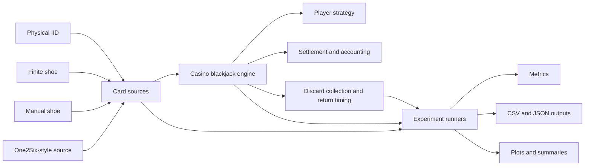

# One2Six Advantage-Play Project

Python simulation and experiment code behind the MathematicalEV investigation into continuous shuffling machines, physical-card recurrence and player-observable blackjack signals.

The central question is simple:

> Can a continuous shuffling mechanism retain enough short-horizon structure for information visible at the table to alter the expected value of the next deal?

The project models a configurable One2Six-style mechanism, tracks 312 persistent physical cards through the game and compares its output against explicit null and benchmark card sources.

It does not assume that a machine is equivalent to IID sampling merely because its output looks noisy.

## Current Research Status

The project has progressed through four broad stages:

1. build and validate the blackjack engine;
2. reconstruct a configurable One2Six-style card source;
3. test whether the mechanism retains physical-card memory;
4. determine whether that memory survives as information observable before a wager.

The strongest published result so far is a player-observable fading-exclusion score based on visible discard history.

On untouched validation seeds:

- the score predicted the composition of the next deal;
- low cards, ten-value cards and aces were predicted separately;
- the strongest high-card-rich band occurred in just under 10% of rounds;
- unconditional One2Six player edge was approximately `-0.462%`;
- the strongest band improved to a point estimate of approximately `-0.002%`.

By point estimate, the signal recovered approximately `99.6%` of the modelled house edge.

The confidence interval crossed zero. This is therefore **not yet a validated positive-EV game**.

The repository now extends beyond that published result into:

- extreme-tail profitability;
- score-conditioned player-action values;
- monetary-streak dependence testing;
- multi-box counterfactual analysis;
- sensitivity to card-return timing and mechanism assumptions.

No betting spread, playing deviation, multi-box strategy or operational advantage policy is currently treated as validated.

## Important Boundaries

This repository contains a model, not a reverse-engineered copy of proprietary firmware.

The current One2Six source:

- represents a mechanism family supported by public documentation and patents;
- preserves physical-card identity;
- models a feeder, carousel compartments, whole-shelf ejection and an output buffer;
- exposes uncertain parameters through configuration;
- does not claim that every production device uses the default settings.

The project has not been validated against a physical production One2Six.

Results should therefore be read as:

> consequences of the stated model and assumptions,

rather than:

> claims about every real machine in operation.

The work is for research and informational purposes. It is not gambling advice, does not guarantee profit and does not recommend using electronic devices or violating casino rules or applicable law.

## Published Articles

The accompanying articles explain the reasoning, model development, experiments and results in narrative form.

- [MathematicalEV](https://www.mathematicalev.com/)
- [Part 1: Why Question the Shuffle?](https://www.mathematicalev.com/blog-3-1/is-the-perfect-shuffle-a-myth-an-analysis-of-the-shufflemaster-one2six)
- [Part 6: Short Physical-Card Returns Are Strongly Suppressed](https://www.mathematicalev.com/blog-3-1/is-the-perfect-shuffle-a-myth-part-6-the-mean-was-not-the-signal)
- [Part 7: Discard History Predicts the Next Deal](https://www.mathematicalev.com/blog-3-1/is-the-perfect-shuffle-a-myth-part-7-the-signal-escapes-the-machine)

The articles are the best place to begin. This repository contains the machinery underneath them.

## Architecture

The simulation separates the card-generating mechanism from the blackjack game and the experiments used to evaluate it.



The main design principles are:

- card sources are separate from game mechanics;
- game rules are separate from player strategy;
- strategy is separate from legal-action validation;
- settlement is separate from card generation;
- randomness is injectable and reproducible;
- physical cards retain stable identities;
- experiments live outside the core simulation package;
- hidden source state is not exposed as a player predictor;
- held-out seeds are used where a candidate signal or policy is evaluated.

## Physical-Card Identity

Cards carry two identifiers:

- `physical_id`: the stable identity of the real card as it moves through the shoe, hand, discard rack, feeder, carousel and output buffer;
- `draw_id`: the unique identity of a particular draw event.

This distinction allows the simulator to measure whether the same physical card returns unusually quickly or slowly.

A symbolic source can generate another ten of spades. It cannot determine whether it is the same physical ten of spades.

## Card Sources

### `IidRandomCardSource`

A symbol-level IID source used for baseline game validation.

Every draw is independent. It does not model a finite shoe or a physical shuffler.

### `PhysicalIidCardSource`

A null model over labelled physical cards.

With six decks, every draw independently selects from all 312 physical identities with replacement. It is not intended to represent casino dealing. It is the memoryless comparator for physical-card recurrence.

### `FiniteShoeCardSource`

A finite collection of physical cards drawn without replacement until its reshuffle policy is triggered.

### `ManualShoeCardSource`

An eight-deck manual-shoe benchmark with configurable cut-card penetration.

It does not reshuffle during a round and preserves physical identities across the shuffle.

### `One2SixCardSource`

A configurable continuous-shuffler approximation.

It:

- accepts ordered discard batches;
- feeds returned cards into a carousel;
- assigns cards to compartments;
- ejects whole shelves;
- places ejected cards into an output buffer;
- draws from the front of that buffer;
- records source-level telemetry;
- preserves each card’s physical identity.

Default parameters are modelling assumptions and can be changed.

## Blackjack Model

The current casino blackjack profile includes:

- six physical decks for the main One2Six comparisons;
- no dealer hole card during the initial deal;
- blackjack paying `3:2`;
- dealer standing on hard and soft 17;
- doubling on 9, 10 or 11;
- doubling after a split;
- one card to split aces;
- no ordinary resplitting;
- original-wager-only treatment when the dealer later makes blackjack after a split or double;
- an initial burn card;
- ordered discard-rack collection;
- return of the previous discard rack after the following initial deal when a shuffling device is used.

The current fixed player strategy is a published approximate multi-deck S17 strategy constrained by the legal actions supported by the engine.

It is not yet a solver-generated exact strategy for every rule and conditional card distribution.

## Repository Layout

```text
.
├── experiments/              # Metrics, experiment logic, plots and summaries
├── scripts/                  # Command-line experiment runners
├── src/
│   └── shufflemaster_sim/    # Core cards, sources, game, strategy and settlement
├── tests/                    # Unit and integration tests
├── environment.yml
├── pyproject.toml
├── README.md
└── LICENSE
```

## Requirements

- Python `3.11` or later
- No mandatory runtime dependencies for the core package
- Optional development tools:
  - pytest
  - pytest-cov
  - Ruff
  - mypy
- Optional analysis dependency:
  - matplotlib

## Installation

Clone the repository:

```bash
git clone https://github.com/mathematical-ev/shufflemaster-simulation.git
cd shufflemaster-simulation
```

Create and activate a virtual environment:

```bash
python -m venv .venv
source .venv/bin/activate
```

On Windows:

```powershell
.venv\Scripts\activate
```

Install the project with development and analysis dependencies:

```bash
python -m pip install --upgrade pip
python -m pip install -e ".[dev,analysis]"
```

## Quality Checks

Run the tests:

```bash
python -m pytest
```

Run linting:

```bash
python -m ruff check .
```

Check formatting:

```bash
python -m ruff format --check .
```

Run strict type checking:

```bash
python -m mypy src
```

Apply Ruff formatting:

```bash
python -m ruff format .
```

## Quick Start

Run a one-box One2Six blackjack baseline:

```bash
python scripts/run_casino_blackjack_baseline.py \
  --rounds 10000 \
  --base-bet 10 \
  --seed 42 \
  --card-source one2six
```

Run source diagnostics without the blackjack engine:

```bash
python scripts/run_one2six_source_diagnostics.py \
  --draws 100000 \
  --seed 42
```

Run the IID comparison:

```bash
python scripts/run_casino_blackjack_baseline.py \
  --rounds 10000 \
  --base-bet 10 \
  --seed 42 \
  --card-source iid
```

Each experiment runner supports:

```bash
python scripts/<runner>.py --help
```

## Research Sequence

### 1. IID Baseline

Validates source frequencies, game outcomes, player-blackjack denominators, profit accounting and recurrence metrics under a memoryless source.

```bash
python scripts/run_iid_baseline_experiment.py \
  --source-draws 10000 \
  --game-rounds 1000 \
  --base-bet 10 \
  --seed 42 \
  --output-dir experiments/outputs/iid_smoke
```

### 2. Single-Box Game Validation

Compares `PhysicalIidCardSource` and `One2SixCardSource` while holding game rules, strategy and wager constant.

```bash
python scripts/run_single_box_game_validation.py \
  --rounds 10000 \
  --base-bet 10 \
  --seeds 42,43 \
  --output-dir experiments/outputs/single_box_game_validation_smoke
```

Primary diagnostics include:

- player edge;
- blackjack rate;
- split and double rates;
- equal-value pair opportunities;
- win, loss and push rates;
- monetary streaks;
- paired source differences.

### 3. Physical-IID Recurrence Null

Measures recurrence of labelled physical cards under independent sampling from the full six-deck population.

```bash
python scripts/run_physical_iid_recurrence_experiment.py \
  --draws 1000000 \
  --deck-count 6 \
  --seed 42 \
  --output-dir experiments/outputs/physical_iid_6deck_1m_seed42
```

For one specified physical card:

```text
p = 1 / 312
```

The number of cards between appearances follows the corresponding geometric waiting-time distribution.

### 4. One2Six Physical-Card Recurrence

Measures how the configurable mechanism changes the same-card return distribution.

```bash
python scripts/run_one2six_recurrence_experiment.py \
  --draws 1000000 \
  --recycle-batch-size 20 \
  --seed 42 \
  --output-dir experiments/outputs/one2six_recurrence_1m_seed42
```

The published batch-20 result reduced returns within 20 cards from approximately `6.52%` under physical IID to approximately `0.53%` under the One2Six model.

The average recurrence remained close to 311 cards because the delayed cards eventually returned.

### 5. Recycle-Batch Sensitivity

Tests whether the recurrence effect survives different card-return batch sizes.

```bash
python scripts/run_one2six_recurrence_sensitivity.py \
  --draws 1000000 \
  --recycle-batch-sizes 1,5,20,52,100 \
  --seed 42 \
  --output-dir experiments/outputs/one2six_recurrence_sensitivity_1m_seed42
```

This matters because return timing is a modelling assumption. An effect that exists only at one convenient batch size is not robust.

### 6. Observable Card-Composition Response

Tests whether visible discard composition predicts future low cards, neutral cards, ten-value cards and aces.

It separates:

1. immediate exclusion while the current rack remains outside the source;
2. delayed effects after a returned batch re-enters the machine.

```bash
python scripts/run_observable_card_response_experiment.py \
  --seeds 42,43 \
  --current-rack-states-per-seed 100 \
  --current-rack-burn-in-rounds 100 \
  --current-rack-sample-interval-rounds 2 \
  --current-rack-probe-cards 15 \
  --lag-rounds-per-seed 2000 \
  --lag-burn-in-rounds 100 \
  --lag-horizon-cards 1000 \
  --output-dir experiments/outputs/observable_card_response_smoke
```

### 7. Held-Out Fading-Exclusion Validation

Combines observable card cohorts into one frozen score.

The published kernel was developed on seeds 42 to 46:

```text
current visible rack             1.00
returned 1-15 cards ago          0.75
returned 16-50 cards ago         0.40
returned 51-100 cards ago        0.20
older returned batches           0.00
```

It was then tested without retuning on seeds 47 to 51.

```bash
python scripts/run_fading_exclusion_validation.py \
  --seeds 47,48,49,50,51 \
  --rounds-per-seed 50000 \
  --burn-in-rounds 1000 \
  --probe-states-per-seed 3000 \
  --probe-cards 15 \
  --base-bet 10 \
  --output-dir experiments/outputs/fading_exclusion_validation_heldout
```

The score is calculated before the wager and before the next initial deal.

### 8. Held-Out Conditional Profitability

Changes the primary endpoint from card composition to player profit.

Development seeds define score-band cutpoints without using their monetary outcomes. Those frozen cutpoints are then applied to fresh validation seeds.

```bash
python scripts/run_conditional_profitability_experiment.py \
  --development-seeds 42,43,44,45,46,47,48,49,50,51 \
  --validation-seeds 52,53,54,55,56,57,58,59,60,61 \
  --development-rounds-per-seed 20000 \
  --validation-rounds-per-seed 100000 \
  --burn-in-rounds 1000 \
  --base-bet 10 \
  --output-dir experiments/outputs/conditional_profitability_validation
```

`PhysicalIidCardSource` remains the negative control.

The fixed player strategy is unchanged during this phase.

### 9. Score-Conditioned Player Actions

Evaluates legal actions from paired copies of the same complete game and source state.

Each legal action is forced once on an isolated branch. Later decisions return to the unchanged fixed strategy.

```bash
python scripts/run_score_conditioned_action_values.py \
  --development-seeds 62,63,64,65,66 \
  --validation-seeds 67,68,69,70,71 \
  --decision-states-per-seed 10000 \
  --burn-in-rounds 1000 \
  --base-bet 10 \
  --output-dir experiments/outputs/score_conditioned_action_values
```

This phase distinguishes:

- generic corrections to the baseline strategy;
- possible One2Six-specific deviations;
- reductions in expected loss;
- actions that genuinely cross into positive conditional value.

No revised playing strategy is deployed during state generation.

### 10. Monetary-Streak Dependence Audit

Tests whether winning and losing streaks contain predictive information beyond the observable card-composition score.

```bash
python scripts/run_streak_dependence_audit.py \
  --seeds 72,73,74,75,76,77,78,79,80,81 \
  --rounds-per-seed 100000 \
  --burn-in-rounds 1000 \
  --base-bet 10 \
  --output-dir experiments/outputs/streak_dependence_audit_10x100k
```

The audit examines:

- run-length distributions;
- survival tails;
- continuation probabilities;
- geometric benchmarks;
- transition behaviour;
- outcome autocorrelation.

Pushes remain neutral in the live streak but are removed from the resolved win/loss sequence used for geometric analysis.

### 11. Extreme-Tail Profitability

Tests whether rarer observable states cross positive expectation under the unchanged one-box strategy.

```bash
python scripts/run_extreme_tail_profitability.py \
  --development-seeds 82,83,84,85,86 \
  --validation-seeds 87,88,89,90,91,92,93,94,95,96 \
  --development-rounds-per-seed 20000 \
  --validation-rounds-per-seed 100000 \
  --burn-in-rounds 1000 \
  --base-bet 10 \
  --output-dir experiments/outputs/extreme_tail_profitability
```

The experiment uses frozen:

- 1% tails;
- 2.5% tails;
- 5% tails;
- 10% tails;
- 20% tails.

Selective entry is considered only if positive conditional EV survives the held-out gate.

## Experimental Discipline

The project uses several safeguards against finding an edge that exists only because the analysis wanted one.

### Explicit null models

Different questions require different nulls.

- Symbol-level IID validates ordinary game behaviour.
- Physical IID validates recurrence over labelled cards.
- A manual shoe provides a finite physical benchmark.
- The One2Six model changes only the card-generating mechanism.

### Development and held-out seeds

Candidate scores, cutpoints and actions are developed on one set of seeds and evaluated on untouched seeds.

Validation seeds cannot:

- create a candidate;
- change a score definition;
- alter a cutpoint;
- select an action;
- rescue a failed result.

### Player-observable features

Hidden machine state can be used to clone identical counterfactual starting points.

It is not exported as a predictor.

Candidate player information is restricted to what would be observable at the relevant decision boundary, such as:

- visible discard composition;
- cards exposed on the table;
- elapsed dealt-card age of previously returned batches;
- legal game state.

### Independent seeds as the uncertainty unit

Round-level outcomes may be serially dependent under a stateful card source.

Independent simulation seeds are therefore the primary unit for uncertainty estimates and source comparisons.

### Negative results remain results

The project has explicitly tested and closed hypotheses that did not survive:

- ordinary monetary streaks did not provide useful incremental prediction;
- physical-card identity is not itself player-observable;
- a conditional composition signal does not automatically imply a profitable action;
- a near-zero point estimate is not proof of positive expectation.

## Outputs

Experiment runners generally write some combination of:

- `summary.md`
- `summary.json`
- `summary.csv`
- compact per-seed CSV files
- diagnostic plots
- configuration metadata
- source telemetry
- validation metrics

Output directories are specified explicitly through `--output-dir`.

Large raw event histories are avoided where aggregate or streaming statistics are sufficient.

## Reproducibility

For a published result, record:

- repository commit or release;
- full command;
- model configuration;
- development seeds;
- validation seeds;
- output directory;
- runtime environment;
- generated summary files.

Randomness is injected and seeded explicitly.

Future article milestones should be tagged as repository releases so that the code corresponding to each published result remains recoverable.

## Issues and Corrections

This is an active investigation.

Useful issues include:

- reproducible bugs;
- incorrect blackjack rules or settlement;
- measurement-definition errors;
- statistical concerns;
- hidden leakage between development and validation;
- public documentation relevant to One2Six-style mechanisms;
- sensitivity analyses that should be added;
- disagreements about what a result does or does not establish.

An interesting result is not protected from criticism merely because I spent a long time computing it.

## Licence

This project is licensed under the GNU General Public License v3.0 or later.

See [LICENSE](LICENSE) for the full licence text.
